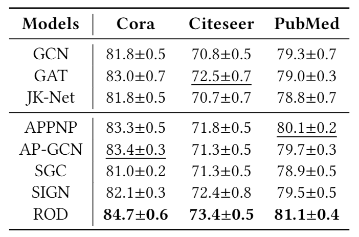
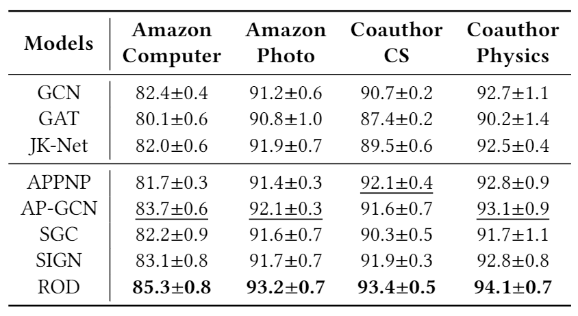
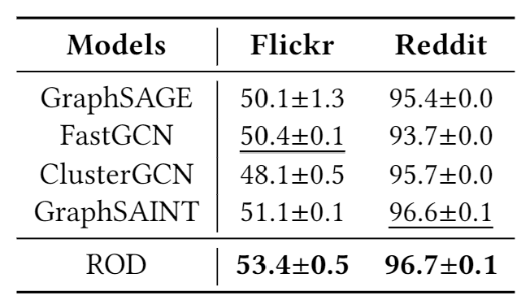
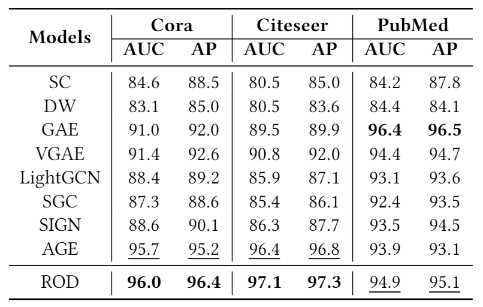
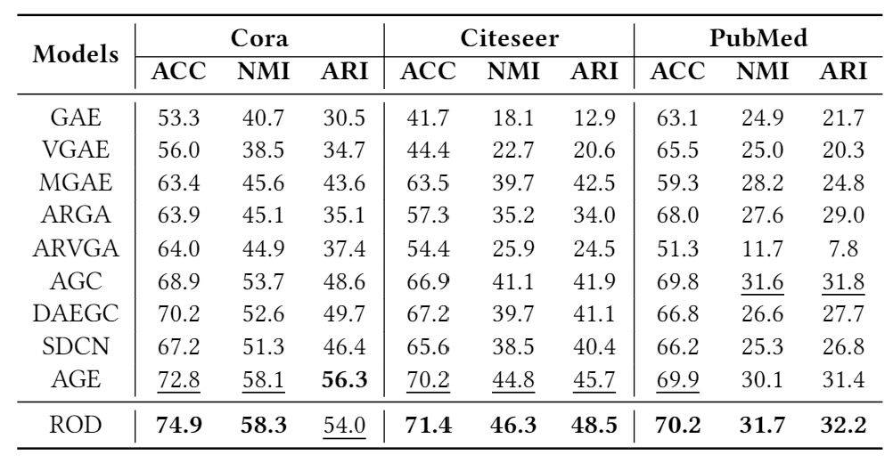

# ROD: Reception-aware Online Distillation for Sparse Graphs .

This repository is the official implementation of ROD. 


## Requirements

Environment: 16GB(RAM), Ubuntu 16.04 (OS), TITAN RTX (GPU), Xeon Gold 5120 (CPU)

To install requirements:

```setup
pip install -r requirements.txt
```


## Training

To train the model(s) in the paper:


> cd the  “examples” data

>run the ipynb notebook file "test_classification.ipynb", "test_link_prediction.ipynb", "test_clustering.ipynb"


## Results

1.  Node Classification:

    ​	(1) transductive setting:





​		(2) inductive setting:



2. Link Prediction:



3. Node Clustering:

